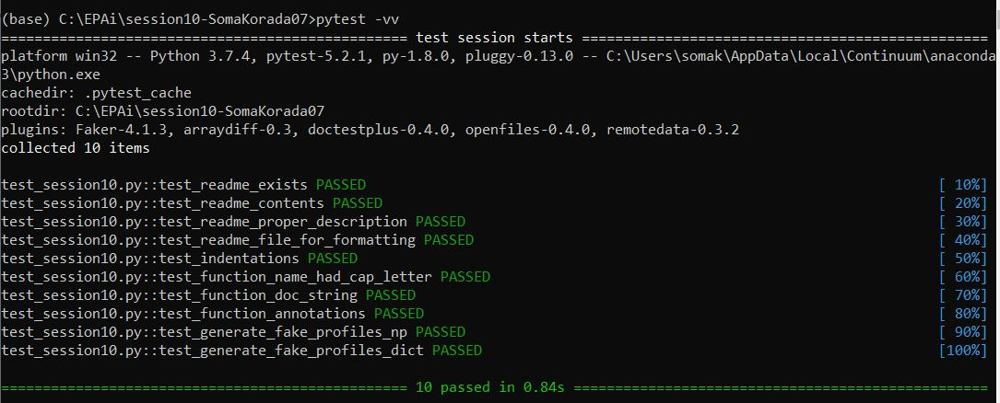

# Tuples and Named Tuples

A tuple is a collection which is ordered and **immutable**. Python supports a type of container like dictionaries called `namedtuple` present in module, `collections`. Like dictionaries they contain keys that are hashed to a particular value. But on contrary, it supports both access from key value and iteration, the functionality that dictionaries lack.


## Faker

- **Faker** is a Python package that generates fake data for you. Faker has the ability to print/get a lot of different fake data, for instance, it can print fake name, address, email, text, etc. We make use of fake profiles and companies for our purpose.

```
from faker import Faker

faker = Faker() # creating faker object

faker.profile() # generates a fake profile

faker.company() # generates a fake company name
```


## Creating fake profiles using NamedTuple

- We have to use Faker library to get 10000 random profiles. Using named tuple, have to calculate the most frequently appearing blood type, mean current location of all the profiles, Profile with oldest person and the age and average age calculated from all the profiles. This has to be repeated using dictionaries instead of named tuples for runtime comparison.
- To store the 10000 profiles, we make use of named tuple to store each profile. Then store 10000 of these in a list. Alternatively, we could have used tuple or named tuple to store each profile. But it's not efficient to use them for this purpose as each profile data is constant and hence won't change. But when we generate each profile, we add it to the list as named tuple. With this, we just add that extra memory to the list. But if we use named tuple or tuple instead, python will keep on creating new tuples every time we add another profile. That's highly inefficient. This way, if we create and add 10000 profiles one by one, we make 10000 different tuples in the memory.

```
def generate_fake_profiles_np(num_profiles: int):
	"""
	Function, takes a number as input and generates those many number
	of fake user profiles. Each of those profiles is stored as a named 
	tuple and a list of such namedtuples is returned.
	"""
	fake_profiles = []
	CreateProfiles = namedtuple('CreateProfiles', " ".join(list((faker.profile()).keys())))
	for _ in range(num_profiles):
		fake_profiles.append(CreateProfiles(**faker.profile()))
	return fake_profiles
```


## Creating fake profiles using Dictionary

- List of dictionaries is the approach taken to keep the comparison consistent.

  ```python
  def generate_fake_profiles_dict(num_profiles: int):
  	"""
  	Function, takes a number as input and generates those many number
  	of fake user profiles. Each of those profiles is stored as a dictionary
  	and a list of such dictionaries is returned.
  	"""
  	fake_profiles = []
  	for _ in range(num_profiles):
  		fake_profiles.append(faker.profile())
  	return fake_profiles
  ```


## Average time for execution of a function

- A decorator factory to calculate average time.

  ```python
  def timed(fn: "Function"):
      """
      Decorator to calculate run time of a function.
      """
      @wraps(fn)
      def calculate_time(*args, **kwargs):
          start = perf_counter()
          result = fn(*args, **kwargs)
          end = perf_counter()
          time_elapsed = (end - start)
          print('Run time: {0:.4f}s'.format(time_elapsed))
          return result
      return calculate_time
  ```


## Comparison of runtime between NamedTuple and Dictionary

- There was no clear winner! Sometimes NamedTuple performed better than Dictionary while at some other instances it was vice versa.


## Imaginary Stock Exchange

- The task here is to create a fake data (you can use Faker for company names) for imaginary stock exchange for top 100 companies (name, symbol, open, high, close). Assign a random weight to all the companies. Calculate and show what value stock market started at, what was the highest value during the day and where did it end. Make sure your open, high, close are not totally random.

- We make use of namedtuple to store each stock and a list to store all the namedtuples for the very same reason described in the previous section.

- One instance of our index is as follows:

  ```
  INDEX(Index_Open=3435.85, Index_High=4307.94, Index_Close=3792.92)
  ```
  
  

## Test Results

