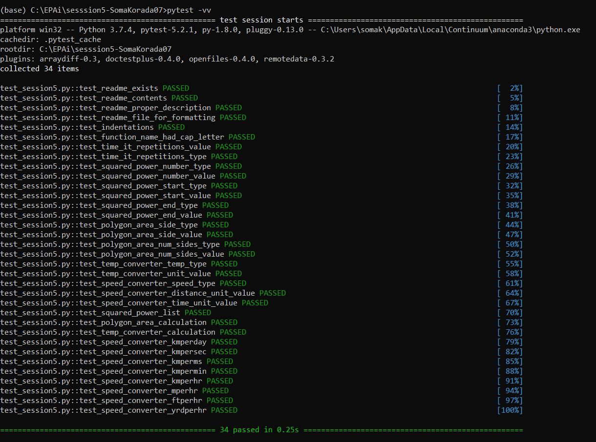

# SESSION 5 - Functional Parameters

## time_it()

- Purpose of the function is to return average run time per call of the function passed to it.
- Takes one positional argument "fn" and one keyword or named argument "repetitions".
- Any other positional argument passed is exhausted by args and any other keyword argument is exhausted by kwargs.
- It calls the function "fn" by passing args and kwargs as arguments for "repetitions" number of times and calculates the average time taken to make one call of the function "fn".
- Raises ValueError if "repetitions" is either 0 or a negative integer.
- Raises TypeError if "repetitions" is not an integer.


## squared_power_list()

- Purpose of the function is to return a list of power of the number "n" from "start" to "end" both inclusive.
- Raises TypeError if "number" is not an integer.
- Raises TypeError if "start" is not an integer.
- Raises TypeError if "end" is not an integer.
- Raises ValueError if "number" is either 0 or a negative integer.
- Raises ValueError if "start" is greater than 5 or a negative integer.
- Raises ValueError if "end" is greater than 15 or a negative integer.


## polygon_area()

- Purpose of the function is to return the area of regular polygon.
- Calculates the area based on 

- Takes length of the side and number of sides as arguments.
- Raises TypeError if "side_length" is not an integer or float or Decimal.
- Raises TypeError if "num_sides" is not an integer.
- Raises ValueError if "side_length" is either 0 or a negative integer.
- Raises ValueError if "num_sides" is greater than 6 or less than 3.


## temp_converter()

- Purpose of the function is to return the converted temperature from Fahrenheit to Celsius or vice versa of the input temperature.
- Converts based on


- Raises TypeError if "given_temp" is not an integer or float or Decimal.
- Raises ValueError if "given_unit" is neither Fahrenheit nor Celsius.


## speed_converter()

- Purpose of the function is to return the speed converted based on the desired units.
- Takes "given_speed" as input which is always in km/hr.
- Takes desired "distance_unit" and "time_unit" as arguments.
- Raises TypeError if "given_speed" is not an integer or float or Decimal.
- Raises ValueError if desired "distance_unit" is neither kilometer, meter, feet nor yard.
- Raises ValueError if desired "time_unit" is neither millisecond, second, minute, hour nor day.

```python
def speed_converter(*args, **kwargs):
    for i in args:
        given_speed = i

    given_distance = given_speed
    given_time = 1

    distance_unit = kwargs['dist']
    time_unit = kwargs['time']

    if type(given_speed) not in [int, float, Decimal]:
        raise TypeError('Given temperature is not a number!')

    if distance_unit not in ['km', 'm', 'ft', 'yrd']:
        raise ValueError('Distance unit is neither kilometer, meter, feet nor yard!')

    if time_unit not in ['ms', 's', 'min', 'hr', 'day']:
        raise ValueError('Time unit is neither millisecond, second, minute, hour nor day!')

    if distance_unit == 'km':
        converted_dist = given_distance
    elif distance_unit == 'm':
        converted_dist = given_distance * 1000
    elif distance_unit == 'ft':
        converted_dist = given_distance * 3280.84
    else:
        converted_dist = given_distance * 1093.61

    if time_unit == 'hr':
        converted_time = given_time
    elif time_unit == 'ms':
        converted_time = given_time * 3.6e+6
    elif time_unit == 's':
        converted_time = given_time * 3600
    elif time_unit == 'min':
        converted_time = given_time * 60
    else:
        converted_time = given_time * 0.0416667

    converted_speed = converted_dist / converted_time

    return round(converted_speed, 1)
```


## Test Results



