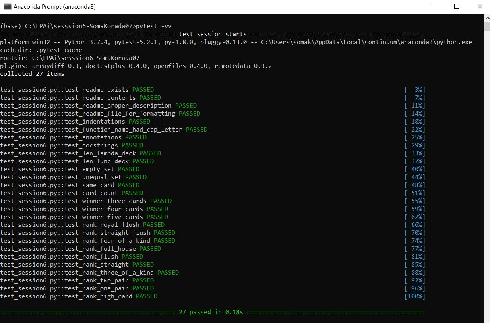

# SESSION 6 - First Class Functions Part I

## Objective

To write logic to determine the winner between two players in a game of Poker. Each player should have equal number of cards. Number of cards allowed for each player is either 3 or 4 or 5.


## lambda

- A lambda function is an anonymous function.
- A lambda function can take any number of arguments, but can only have one expression.

```python
lambda arguments: expression
```


## map

- **map()** function returns a map object (which is an iterator) of the results after applying the given function to each item of a given iterable (list, tuple etc.)

- The returned value from map() (map object) then can be passed to functions like list() (to create a list), set() (to create a set) .

  **Syntax :**

  ```
  map(fun, iter)
  ```

  **Parameters :**

  > **fun :** It is a function to which map passes each element of given iterable.
  > **iter :** It is a iterable which is to be mapped.


## zip

- The purpose of zip() is to **map the similar index of multiple containers** so that they can be used just using as single entity.

  **Syntax :**
  *zip(\*iterators)*
  **Parameters :**
  *Python iterables or containers ( list, string etc )*
  **Return Value :**
  *Returns a single iterator object, having mapped values from all the*
  *containers.*


## suits

- There are 4 possible suits in a deck of 52 cards - 'spades', 'clubs', 'hearts', 'diamonds'
- Each suit has 13 cards.


## vals

- There are 13 possible values of a card in a deck - '2', '3', '4', '5', '6', '7', '8', '9', '10', 'jack', 'queen', 'king', 'ace'.
- Each value has card associated with each suit. Thus, in total there are 13 (number of possible values) * 4 (number of possible suits) = 52 cards.


## rank

- Based on the value and suit of the cards a player holds, the rank is determined.
- Rank can be determined based on the rules as below in a game of poker.


- Rankings are as below:
  - **Royal Flush** - Top 'n' highest consecutive cards in the deck of one particular suit.
  - **Straight Flush** - 'n' consecutive cards in the deck of one particular suit.
  - **Four of a Kind** - For a set of 5 cards, if the value of 4 cards is same. For a set of 4 cards, it would be if the value of 3 cards is same. For a set of 3 cards, it would be if the value of 2 cards is same.
  - **Full House** - For a set of 5 cards, if value of 3 cards is same and the value of other 2 cards is same but a different value. For a set of 4 cards, if value of 2 cards is same and the value of other 2 cards is same but a different value. Full House is not meaningful for a set of 3 cards.
  - **Flush** - If all the 'n' cards are of a particular suit but do not have any other specific order.
  - **Straight** - If the values of 'n' cards is sequential irrespective of the suit of each card.
  - **Three of a Kind** - For a set of 5 cards, if value of 3 cards is same and the values of other 2 cards are different from each other and also from the value of the 3 cards. For a set of 4 cards, it is similar to "*Four of a Kind*". For a set of 3 cards, the value of all the 3 cards should be same irrespective of the suit of each card.
  - **Two Pair** - For a set of 5 cards, if value of 2 cards is same and value of another 2 cards is same but different from the first value and value of 5th card is different from the first two values. For a set of 4 cards, it is similar to "*Full House*". Two Pair is not meaningful for a set of 3 cards.
  - **One Pair** - For a set of 5 cards, if value of 2 cards is same and values of other 3 cards are all different from each other and also from first value. For a set of 4 cards, if value of 2 cards is same and values of other 2 cards are all different from each other and also from first value. For a set of 3 cards, it is similar to "*Four of a Kind*".
  - **High Card** - If all 'n' cards have different values in both the sets, then the set with the highest value card is the winner.


## Test Results

