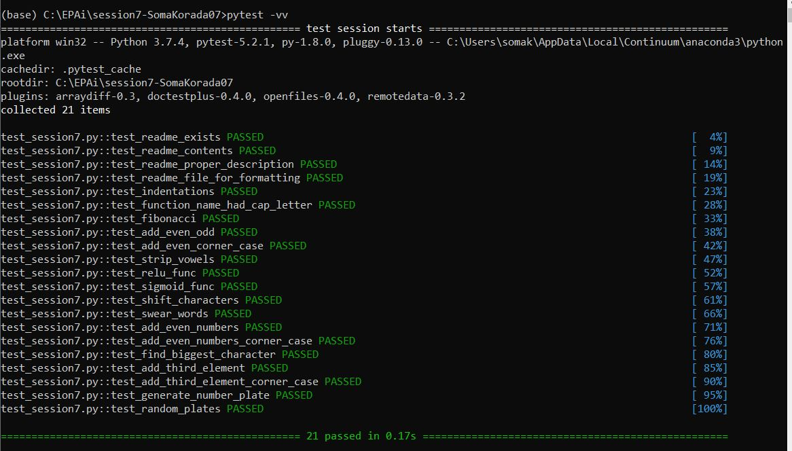

# First Class Functions - Part 2

## reduce

- The reduce function is used to apply a particular function passed in its argument to all of the list elements mentioned in the sequence passed along.

- This function is defined in "**functools**" module.

  

## partial

- Partial functions allow us to fix a certain number of arguments of a function and generate a new function.

- Partial functions can be used to derive specialized functions from general functions and therefore help us to reuse our code.

  

## check_fibonacci

- A pre-calculated list to store Fibonacci numbers till 10000.

  ```
  fibonacci_numbers = [0, 1]
  while fibonacci_numbers[-1] + fibonacci_numbers[-2] < 10000:
      fibonacci_numbers.append(fibonacci_numbers[-1] + fibonacci_numbers[-2])
  ```

  

- Using only list, filter and lambda to tell whether a number is a Fibonacci number or not.

  ```
  check_fibonacci = lambda l : list(filter(lambda x: x in fibonacci_numbers, l))
  ```

  

## add_even_odd

- List comprehension to add 2 iterables a and b such that a is even and b is odd.

  ```
  add_even_odd = lambda a, b : [x + y for x, y in zip(a, b) if x % 2 == 0 and y % 2 != 0]
  ```

  

## strip_vowels

- List comprehension to strip every vowel from a string provided.

  ```
  vowels = ['a', 'e', 'i', 'o', 'u', 'A', 'E', 'I', '0', 'U']
  strip_vowels = lambda s : [x for x in s if x not in vowels]
  ```

  

## relu_func

- List comprehension to act like a ReLU function for a 1D array.

  ```
  relu_func = lambda l : [x if x > 0 else 0 for x in l]
  ```

  

## sigmoid_func

- List comprehension to act like a sigmoid function for a 1D array.

  ```
  sigmoid_func = lambda l : [(1 / (1 + math.exp(-x))) for x in l]
  ```

  

## shift_characters

- List comprehension that takes a small character string and shifts characters by 5

  ```
  alphabets = ['a', 'b', 'c', 'd', 'e', 'f', 'g', 'h', 'i', 'j', 'k', 'l', 'm', 'n', 'o', 'p', 'q', 'r', 's', 't', 'u', 'v', 'w', 'x', 'y', 'z']
  shift_characters = lambda s : "".join([alphabets[alphabets.index(x) + 5] if alphabets.index(x) < 21 else alphabets[alphabets.index(x) - 26 + 5] for x in s])
  ```

  

## check_swear_words

- List comprehension to check if given input has any swear words mentioned in 

```
with open("swear_words.txt", "r") as f:
    swear_words = f.read().split()

check_swear_words = lambda s : any([word for word in s.split() if word.lower() in swear_words])
```


## add_even_numbers

- Reduce function to add only even numbers in a list.

  ```
  add_even_numbers = lambda l : reduce(lambda a, b: a + b if b % 2 == 0 else a, l, 0)
  
  ```

  

## find_biggest_character

- Reduce function to find the biggest character in a string.

  ```
  find_biggest_character = lambda s : reduce(lambda x, y: x if ord(x) > ord(y) else y, s)
  
  ```

  

## add_third_element

- Reduce function to add every 3rd number in a list.

  ```
  add_third_element = lambda l : reduce(lambda x, y: x + y, l[2::3], 0)
  
  ```

  

## generate_number_plate

- An expression that generates 15 random KADDAADDDD number plates, where KA is fixed, D stands for a digit, and A stands for Capital alphabets. 10<<DD<<99 & 1000<<DDDD<<9999.

  ```
  generate_number_plate = lambda : [f"KA{random.randint(10, 99)}{chr(random.randint(65, 90))}{chr(random.randint(65, 90))}{random.randint(1000, 9999)}" for i in range(15)]
  
  ```

  

## random_plates_partial

- Partial function to let user input state ID and plate number.

  ```
  random_plates = lambda st='KA', number_plate='1234' : [f"{st}{random.randint(10, 99)}{chr(random.randint(65, 90))}{chr(random.randint(65, 90))}{number_plate}" for i in range(15)]
  
  random_plates_partial = partial(random_plates, st = 'DL', number_plate = '7777')
  
  ```

  

## Test Results

