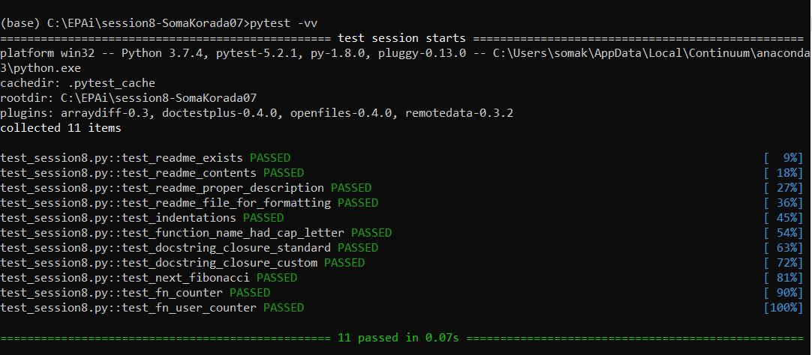

# Functional Parameters

## Closure

- A **closure** is a nested function which has access to a free variable from an enclosing function that has finished its execution.

- Three characteristics of a **Python closure** are: 

  - it is a nested function
  - it has access to a free variable in outer scope
  - it is returned from the enclosing function

- A closure—unlike a plain function—allows the function to access those captured variables (free variables) through the closure’s copies of their values or references, even when the function is invoked outside their scope.

- As closures are used as callback functions, they provide some sort of data hiding. This helps us to reduce the use of global variables.

- When we have few functions in our code, closures prove to be efficient way.

- "\__closure__" attribute of a function tells if a function is a closure or not.

- "\__code__.co\_freevars" lists the free variables.

  

## check_docstring

- A closure that takes a function as input and then checks whether the function passed has a docstring with more than 50 characters. 50 is stored as a free variable.

  


## next_fibonacci

- It is a closure that gives the next Fibonacci number.

  ```python
  def next_fibonacci():
  	"""
  	This closure gives the next Fibonacci number.
  
  	# Input : no input
  
  	# Output : function inner
  
  	# Functionality : Defines 2 free variables - x and y. Defines another function which calculates the next fibonacci
  					  number.
  	"""
  	x = 0
  	y = 1
  	def cal_fibonacci():
  		"""
  		Determines next fibonacci number and recalculates x and y accordingly. Returns the next Fibonacci number.
  		"""
  		nonlocal x, y
  		fib = x + y
  		x = y
  		y = fib
  		return fib
  	return cal_fibonacci
  ```


## fn_counter

- A closure that keeps track of how many times a function is called and updates a global dictionary variable with the counts.

  ```python
  func_counter = {}
  def fn_counter(fn) -> "function":
  	"""
  	This closure keeps a track of how many times a function was called and updates a global dictionary with the counts.
  
  	# Input : function fn
  
  	# Output : function inner
  
  	# Functionality : Defines a global dictionary - func_counter and a free variable - cnt. Defines another function which
  					  increments the free variable whenever the function fn is called and stores in func_counter.
  	"""
  	cnt = 0
  	def increment_counter(*args, **kwargs):
  		"""
  		Increments the free variable for the function fn and updates the global dictionary.
  		"""
  		nonlocal cnt
  		global func_counter
  		cnt += 1
  		func_counter[fn.__name__] = cnt
  		return fn(*args, **kwargs)
  	return increment_counter
  ```


## fn_user_counter

- A closure that takes a dictionary as input and updates the count of number of times a function has been called in the input dictionary.

  ```python
  def fn_user_counter(fn, user_dict) -> "function":
  	"""
  	This closure is updated version of the above. It takes in a specific dictionary to update the counts.
  
  	# Input : function fn and dictionary user_dict
  
  	# Output : function inner
  
  	# Functionality : Takes a function fn and dictionary user_dict as inputs. Defines another function to update the input
  					  dictionary with the count for the specific function fn.
  	"""
  	def increment_user_counter(*args, **kwargs):
  		"""
  		Updates the input dictionary with the count for the specific function fn.
  		"""
  		user_dict[fn.__name__] += 1
  		return fn(*args, **kwargs)
  	return increment_user_counter
  ```


## Test Results

