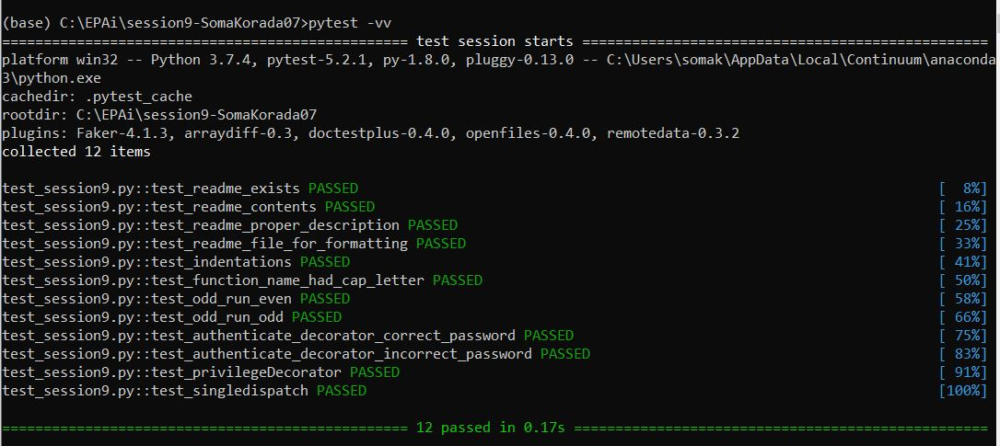

# Decorators

A **decorator** in **Python** is any callable **Python** object that is used to modify a function or a class.


## Execute function only at odd seconds

- Decorator to execute function only if the current time's 'second' value is odd.

```
def odd_run(fn : "Function"):
	"""
	Decorator to allow a function to run only on odd seconds.
	"""
	@wraps(fn)
	def run_func(*args, **kwargs):
		if (datetime.datetime.now().time().second % 2 != 0):
			return fn(*args, **kwargs)
		else:
			print('Sorry, time is in even secs. Cannot run the function!')

	return run_func
```


## Log for a function

- Decorator to log a function.

```
def log_decorator(fn : "Function"):
	"""
	Decorator to log the function calls.
	"""
	from datetime import datetime, timezone

	@wraps(fn)
	def add_log(*args, **kwargs):
		start_time = datetime.now(timezone.utc)
		result = fn(*args, **kwargs)
		end_time = datetime.now(timezone.utc)
		print(f'{start_time}: called {fn.__name__} with execution time {start_time - end_time}')
		return result
	
	return add_log
```


## Authenticate before invoking a function

- Decorator to implement authentication functionality.

  ```python
  def authenticate(current_password: str, user_password: str):
      """
      Wrapper used to authenticate the function before executing the function.
      curr_password: `set_password` closure to get password from user.
      :param user_password: pre-defined password compared with the `curr_password`.
      """ 
      current_password = "TSAI@Welcome"
      def authenticate_decorator(fn):
      	"""
  
      	"""
      	@wraps(fn)
      	def inner(*args, **kwargs):
      		if(user_password == current_password):
      			return fn(*args, **kwargs)
      		else:
      			print('Sorry, you are not authorized!')
      	return inner
  
      return authenticate_decorator
  ```


## Average time for execution of a function

- A decorator factory that takes in an integer which defines the number of iterations a function has to be invoked to calculate average time.

  ```python
  def timed(times : int):
  	"""
  	Decorator to count number of times a function is called
  	"""
  	from time import perf_counter
  	from functools import wraps
  
  	def timed_decorator(fn):
  		@wraps(fn)
  		def count_function_calls(*args, **kwargs):
  			elapsed_total = 0
  			elapsed_count = 0
  
  			for i in range(times):
  				start = perf_counter()
  				result = fn(*args, **kwargs)
  				end = perf_counter()
  				elapsed = end - start
  				elapsed_total += elapsed
  				elapsed_count += 1
  
  			elapsed_avg = elapsed_total / elapsed_count
  
  			print(f'{fn.__name__} took {elapsed_avg} seconds')
  
  			return result
  
  		return count_function_calls
  
  	return timed_decorator
  ```


## privilegeDecorator class

- A decorator class that provides privilege access. A function can have four parameters and based on the privileges (high, mid, low, no), access is given to all 4, 3, 2 or 1 parameters.

  ```python
  class privilegeDecorator:
  	"""
  	Decorator to provide privilege access 
  	(has 4 parameters, based on privileges (high, mid, low, no), gives access to all 4, 3, 2 or 1 params)
  	"""
  	def __init__(self, privilege = 'no'):
  		self.privilege = privilege
  
  	def __call__(self, fn):
  		@wraps(fn)
  		def set_privilege(**kwargs):
  			arguments = list(kwargs.items())
  			if self.privilege == "high":
  				return fn(**dict(arguments[:4]))
  			elif self.privilege == "mid":
  				return fn(**dict(arguments[:3]))
  			elif self.privilege == "low":
  				return fn(**dict(arguments[:2]))
  			elif self.privilege == "no":
  				return fn(**dict(arguments[:1]))
  
  		return set_privilege
  ```


## Single Dispatch

- PEP443 proposed to expose a mechanism in the `functools` standard library module in Python 3.4 that provides a simple form of generic programming known as single-dispatch generic functions.
- To define a generic function, decorate it with the `@singledispatch` decorator. The dispatch happens on the type of the first argument.
- To add overloaded implementations to the function, the `register()` attribute of the generic function is used. It is a decorator, taking a type parameter and decorating a function implementing the operation for that type.

```
@singledispatch
def htmlize(input_str: str) -> str:
    """
    Converts the newline character in a string to contain a br tag.
    input: string to escape.
    return: string, transformed
    """
    return escape(str(input_str)).replace("\n", "<br/>\n")
```


## Test Results

